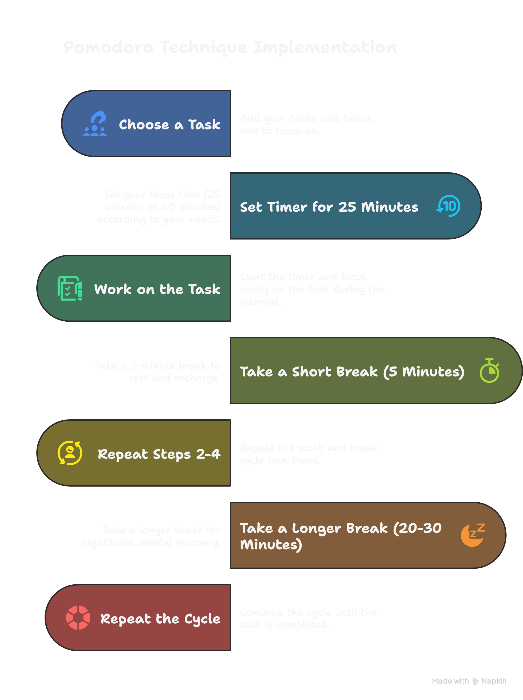
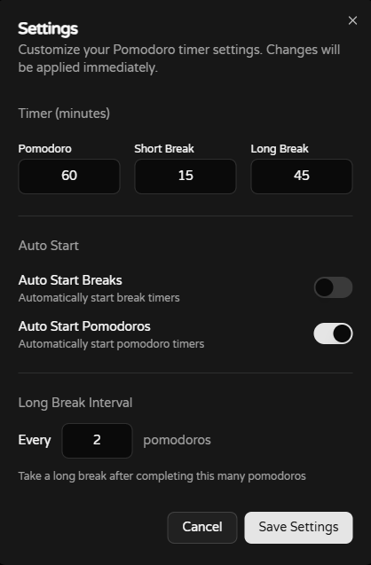
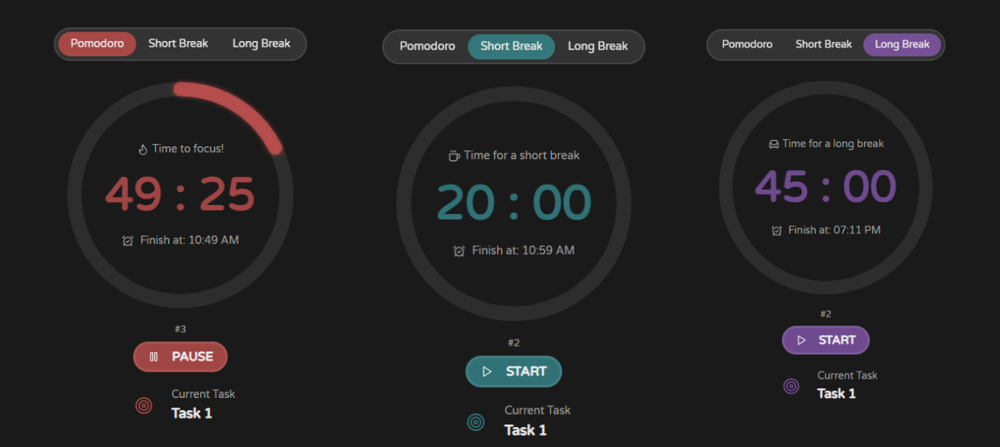
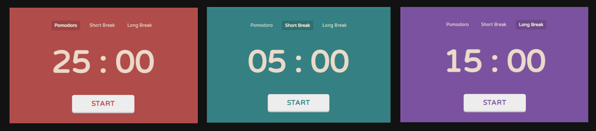
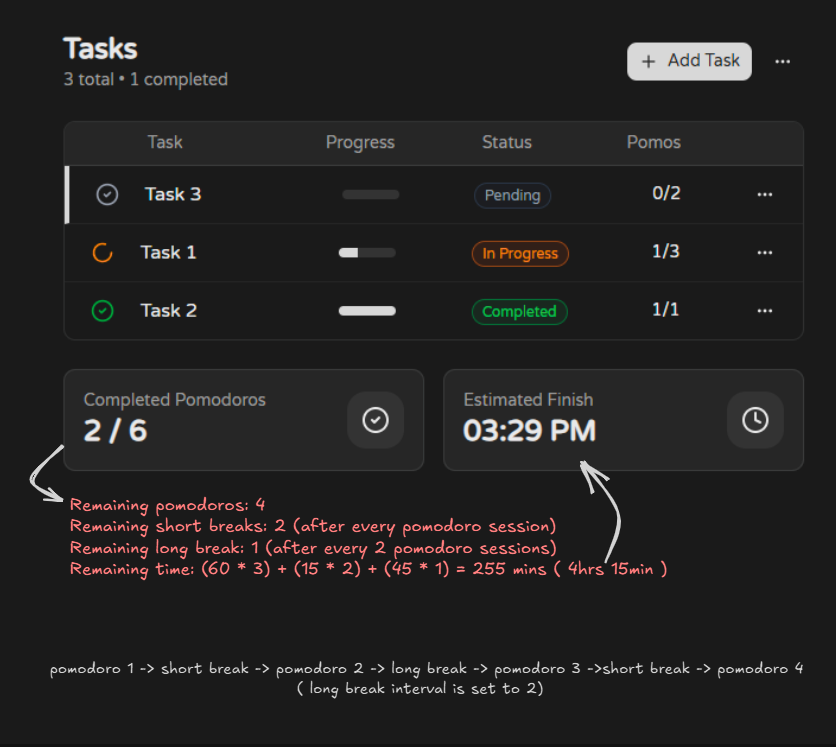
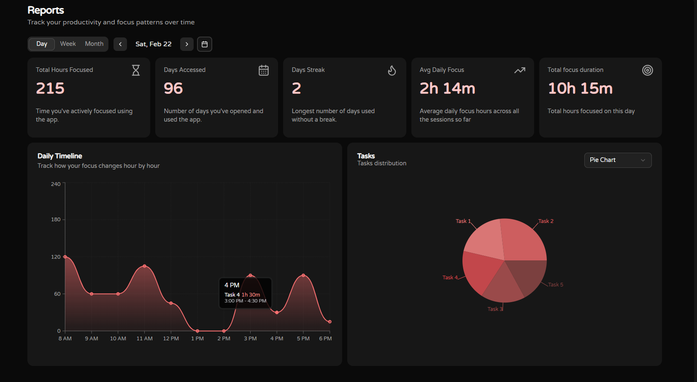
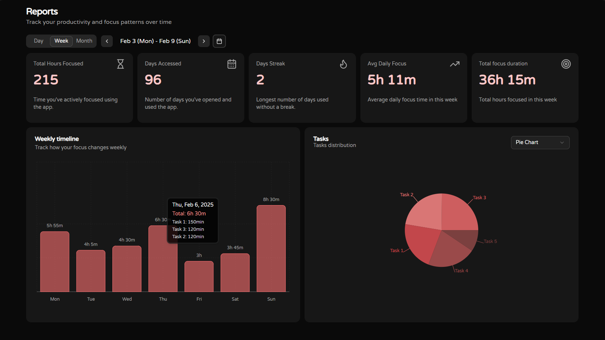
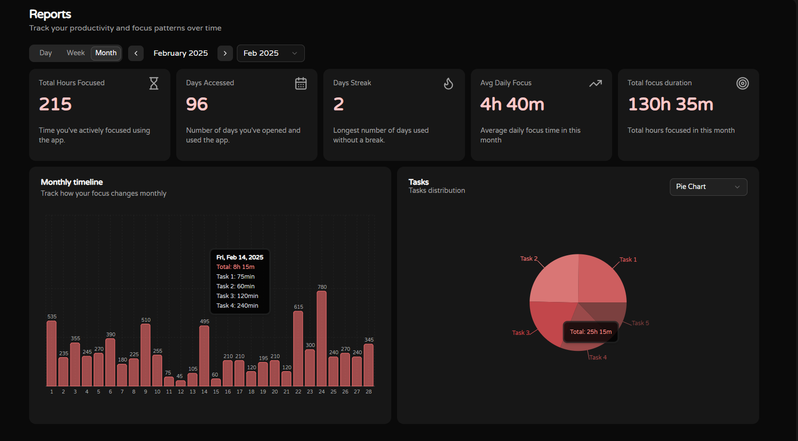
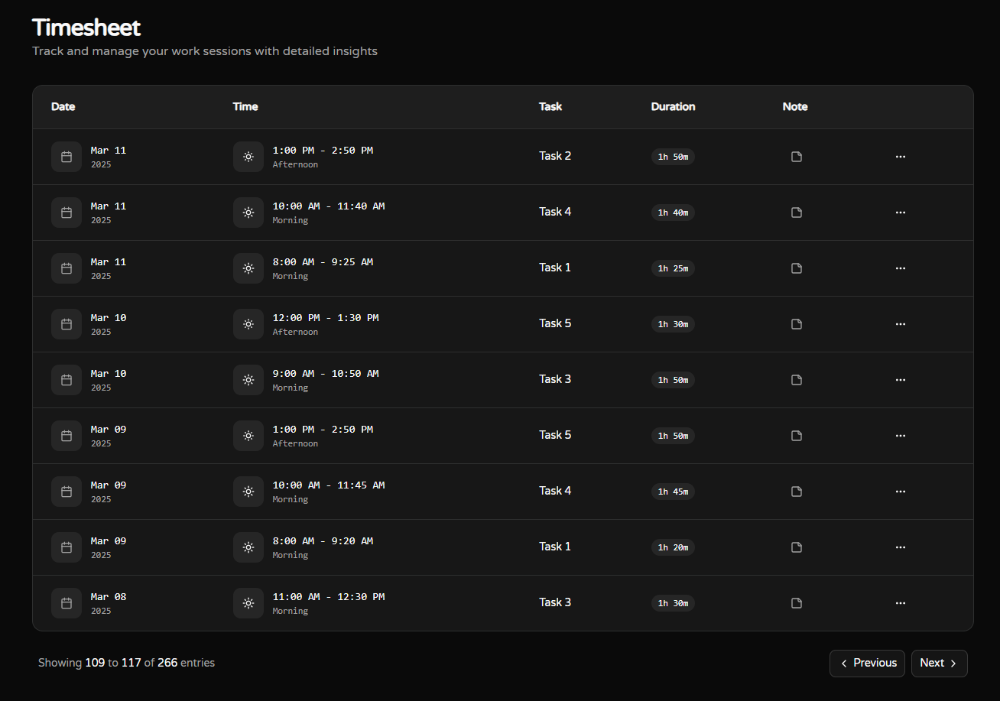
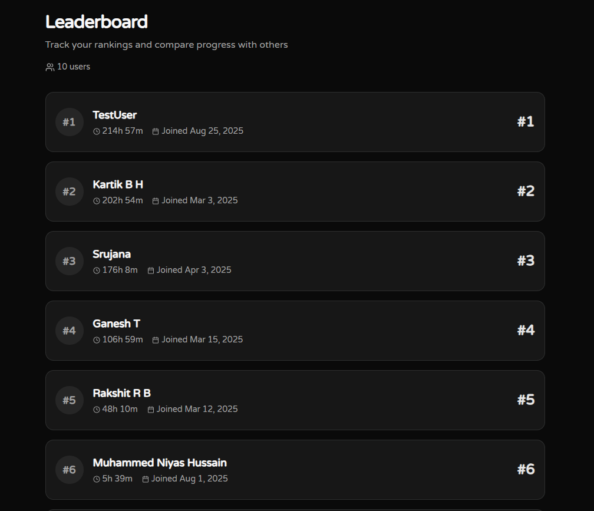

# Pomowaves

Pomowaves is a web app built to boost your productivity. The goal of this app is to help you stay focused on any task, whether it's studying, writing, or coding. This app is inspired by the **Pomodoro Technique**, a time management method developed by **Francesco Cirillo**.

## 📌 What is the Pomodoro Technique?

The **Pomodoro Technique** was created by Francesco Cirillo as a structured way to work and study more efficiently. It uses a timer to break work into intervals, traditionally **25 minutes** in length, followed by short breaks. Each interval is known as a **pomodoro** (Italian for “tomato”), named after the tomato-shaped kitchen timer Cirillo used as a university student.

> *"The technique is simple yet powerful: work with time, not against it."* - Wikipedia

## 🎯 How to Use the Pomodoro Timer?

1. **Add tasks** to work on today.
2. **Set estimated pomodoros** (1 pomodoro = 25 minutes of focused work) for each task.
3. **Select a task** to work on.
4. **Start the timer** and focus on the task for **25 minutes**.
5. **Take a 5-minute break** when the timer rings.
6. **Repeat the cycle** until all tasks are completed.
7. **Track your productivity** with daily, weekly, and monthly progress insights to improve your workflow.
8. Stay focused, be productive, and make the most out of your work sessions with Pomowaves!

## Features
### Customizable Timers & Auto-Start Options  
 
Pomowaves allows you to personalize your focus and break sessions to match your workflow. You can:  

- ⏳ Set custom durations for **Pomodoro (work session), short breaks, and long breaks** based on your preference.  
- 🔄 Enable **Auto-Start for Pomodoros and Breaks** to seamlessly switch between work and rest sessions without manual intervention, helping you stay in the flow. 
- ⏱️ Configure the **Long Break Interval**, which determines how many Pomodoro sessions you complete before taking a long break.  

These features provide flexibility and automation, making it easier to stay focused and maintain a consistent work rhythm. 🎯  

<!--  -->

### Task Management & Progress Tracking  

 An intuitive task management system to help you stay focused and track your progress efficiently.  

 

- 📝 **Add Tasks:** Easily add tasks you plan to work on for the day.  
- 🎯 **Set Pomodoro Estimates:** Assign the number of Pomodoros needed to complete each task.  
- 🔄 **Track Task Progress:** Each task displays the **completed Pomodoros / total Pomodoros**, giving you a clear view of how much work is left.  
- ✅ **Mark Tasks as Completed:** Finished tasks are visually highlighted, helping you stay motivated.  
- 📊 **Overall Task Progress:** See an overview of all tasks in progress, including how many Pomodoros are completed.  
- ⏳ **Estimated Completion Time:** The app calculates the estimated finish time based on your remaining pomodoros and timer settings.  

With this structured task management system, Pomowaves helps you stay on top of your work while efficiently utilizing the Pomodoro Technique! 🚀  

## Reports

Pomowaves provides detailed reports to help you analyze your productivity and gives a high-level overview of your focus time and progress:

### Daily stats

### Weekly stats

### Monthly stats

### Timesheet
The Details section provides an in-depth log of all Pomodoro sessions, including:

- 📅 **Date & Time** – When the session took place.
- ✅ **Task Name** – The task worked on.
- ⏳ **Duration** – The total focus time spent on that task.
- 📝 **Note** – A short note about the session. 

### Leaderboard
Compete with other users and track your rank on the Leaderboard:

- 🏆 Displays users with the **highest total focus hours**.
- 🥇 Shows **rankings, usernames, and total duration** of focused time.
- 🚀 Stay motivated by **climbing the leaderboard**!

## Technologies Used  

### Frontend  
- **React.js** – The core framework used to build the Pomowaves UI, ensuring a smooth and interactive user experience.  
- **TailwindCSS** – Utility-first CSS framework for building a responsive and visually appealing interface.  
- **ShadCN UI** – A component library built on Radix UI and TailwindCSS, used to create accessible and customizable UI components.  

### State Management  
- **Zustand** – A lightweight and scalable state management library that replaces reducers and Context API, making state handling more efficient.  

### Data Layer  
- **TanStack Query (React Query)** – For efficient data fetching, caching, prefetching, ensuring seamless API interaction and a responsive user experience. 
 

### Data Visualization  
- **Recharts** – Used to display focus hour statistics in visually appealing bar charts, enabling users to track their productivity trends over time.  

### Backend & Authentication  
- **Appwrite** – Handles the backend, including user authentication, database management. 
- **OAuth Google Authentication** – Integrated via Appwrite, allowing users to log in seamlessly using their Google accounts.  

